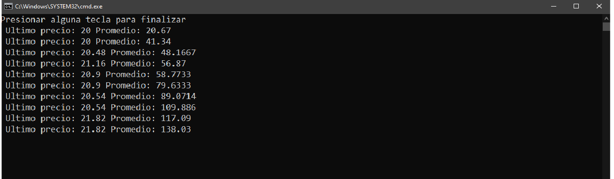

# Creando un par de subprocesos de lectura y escritura en C++

En este ejemplo, estamos intentando simular la llegada dinámica de datos de mercados, como los precios de las acciones de una bolsa. Dichos datos llegan aleatoriamente de un proveedor de datos de mercado. Puede habar períodos sin actualizaciones y períodos en los que hay una alta frecuencia de actualizaciones. Simulamos esto en un subproceso *data_writer* imponiendo un retraso aleatorio entre las “llegadas” de datos que luego se cargan en un vector (matriz dinámicamente). Existe un hilo que “escribe” datos en una matriz dinámica. Un segundo hilo leerá datos de esta misma matriz dinámica. Para proteger la matriz dinámica de lecturas inconsistentes, usaremos un *Mutex* con métodos. *lock* y *unlock* en cada uso de la matriz para evitar la corrupción de datos. El subproceso *data_reader* luego iterará sobre el vector y calculará un precio promedio basado en todos los precios que se han recibido hasta el momento. Esta actividad ocurrirá en un intervalo de tiempo fijo:

```c++
#include <iostream>
#include <thread>
#include <chrono>
#include <mutex>
#include <vector>
using namespace std;

// Mutex para proteger nuestro vector de precios
mutex mtPriceArray; 
vector<double> dblPriceArray;

void data_writer() {
	// Escribir los datos de mercado en el vector dblPriceArray
	while(1){
			this_thread::sleep_for(chrono::milliseconds(rand() % 5000));
			// `Lock` los precios del vector
			mtPriceArray.lock();
			//Crear un precio y cargarlos en el vector
			dblPriceArray.push_back(20.0 * (1+(rand() % 100)/1000.0));
			// Desbloquear el precio del vector
			mtPriceArray.unlock();
			
		 }
	}
void data_reader(int delay) {
	double dblSum = 0;
	double dblAverage = 0;
	while(1) {
			mtPriceArray.lock();
			if (dblPriceArray.size() > 0 ) {
				// Calcular el promerio
				for (unsigned int i = 0; i<dblPriceArray.size(); i++) {
					dblSum += dblPriceArray[i];
					}
					dblAverage = dblSum / dblPriceArray.size();
					cout << " Ultimo precio: " << dblPriceArray[dblPriceArray.size()-1];
					cout << " Promedio: " << dblAverage << endl;
			}
			//Desbloquear los precios del vector
			mtPriceArray.unlock();
			// Esperar para alguna tarea
			this_thread::sleep_for(chrono::milliseconds(delay));
		}
	}
int main() {
	char result;
	thread writer_thread(data_writer);
	thread reader_thread(data_reader, 2000);
	
	// Pausar el hilo principal
	cout << "Presionar alguna tecla para finalizar" << endl;
	cin >> result;
	
	// Une los dos subprocesos de trabajo al subproceso principal
	writer_thread.join();
	reader_thread.join();
	return 1;
}
````

Y se obtiene una respuesta como la siguiente:


